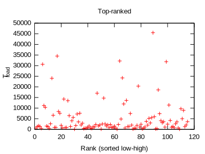
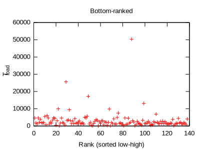
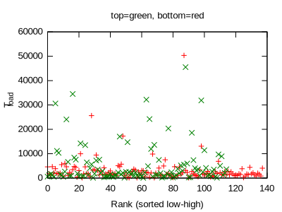

# Are popular websites' load times different from those of less popular ones?
## It's more complicated than you think......
### **Advanced Statistics Final Project**

---

# We browse the web every day.
# When we visit a website, we wait before it fully loads.
 * This is called the load time, $T_{load}$: it measures the time it takes for your browser to download all the resources on the webpage and do book-keeping work. Note that this does not include the rendering time, the time it takes for your graphics to render the webpage.

# Question: Given two categories of websites, are their load times different?

---
# Website Popularity Measure

 **We use the ALEXA ranking, which provides a daily ranking of the top 1m most visited websites in the world.**
 
 **Data url: http://s3.amazonaws.com/alexa-static/top-1m.csv.zip**, changes daily, random day $\triangleq$ random sample
 **Two-sample $t$-test for means: Sample $n1$ top-ranked ALEXA 1m websites and $n2$ bottom-ranked ALEXA 1m websites. Compare the distributions.**
 
 _Dilemma_: ALEXA accounts for both resource-provider websites (a website that serves e.g. images to others) and content-provider websites (a website that serves actual content); we don't want to include resource provider websites' hompages (usually a landing page) in our sample. Solution next page 
 
---
# Loading Time Measure: $T_{load}$
**We use the Chrome web browser in the headless mode, driven by a script, to visit each website.** $\leftarrow$ Simulation of user-controlled browsing experience

$T_{load}=T_{resources}+T_{page}+T_{storage} \leftarrow$ excludes only page rendering time (device-dependent)

---

# Which websites to sample?

A webpage is valid iff: 
 * Either HTTP mode or HTTPS mode returns status code 200 (success) 
 * It may be accessible either via `http://` or `https://`, or both; 
 * For `https`, the encryption certificate must be valid.
 * Take 

$$T_{\text{load}} = \begin{cases} 
\min\{ T_{\text{https}},T_{\text{http}}\} & \text{if both} \\
T_{\text{https}} & \text{if only https} \\
T_{\text{http}} & \text{if only http }
\end{cases}$$

---

# Remarks

This weeds out a large number of "resource provider" websites, e.g. `googleapis.com` returns a `404 Not Found` status code.

For network turbulence, We take the avg in the load times distribution $X$: $T_{load} = \overline{X}$ for $n=3$

Our sampling distribution comes from the population distribution of all valid websites in the ALEXA top 1m ranking.

---
### Examples of top-ranked websites from all over the world

---
### Examples of bottom-ranked websites from all over the world

---

# Potential problems

 * Landing pages might still be included in the sample
 * Measurement is inherently US-centric; we're taking latency measurements from US east coast, so websites in other parts of the world (e.g. Russia, China, India) will behave poorly for $T_{load}$.

---

# Test: 2-sample $t$-test for means, two tails

---

# Conditions ($n_1=115, n_2=138$)

 * Random: $\sqrt{}$, the ALEXA rank is taken for a random day
 * Independent: $\sqrt{}$, our population size $N$ is the total number of active websites, which is very very large... But $n_1,n_2<200$ is small.
 * Normal: $\sqrt{}$, $n_1,n_2>30\rightarrow$ CLT holds.

We do the 2-sample $t$-test for two distributions: the distribution of $T_{load}$ for top-ranked websites and the distribution of $T_{load}$ for bottom-ranked websites.

---
## $T_{load}$ distribution for Top-ranked 115 sites

---
## $T_{load}$ distribution for bottom-ranked 138 sites 

---
# Hypotheses
$H_{0}$: That the mean of avg page load time for sites ranked 1-115 = the mean of avg page load time for sites ranked bottom 1-138

$H_{a}$: That the mean of avg page load time for sites ranked 1-115 $\neq$ the mean of avg page load time for sites ranked bottom 1-138.

---

# $t$-test results ($\alpha=0.05$)
Let $T_1$, $T_2$ be our distributions. $T_1$ is the top-ranked website distribution, $T_2$ is the bottom-ranked website distribution. 
$$S_{T_1}=8106.177131633802$$
$$S_{T_2}=5085.949930330646$$
$$\overline{T_1}=5329.4502753620545$$
$$\overline{T_2}=3064.815464975765$$
$$t^*=\frac{\overline{T_1}-\overline{T_2}}{\sqrt{S_{T_1}^2/n_1+S_{T_2}^2/n_2}}=2.5997102453932923$$
$$p(t>t^*|\text{df}=\min\{n_1,n_2\}-1=114)=0.00528<\alpha=0.05.$$

---
# Conclusion

## We have to reject $H_0$. There is suff evidence to conclude that bottom-ranked sites load faster, on average.

 * $p=0.005282249701030417$ with $\alpha=0.05$!

**Why do low-ranked sites load faster?** Small sites are frequently located on large platforms (e.g. `wordpress.com`, `tumblr.com`); these large platforms have the infrastructure and the sites might have less multimedia content.)
 * Also, large sites might serve a more local audience (e.g. 163.com or mail.ru)

---
# Combined scatterplot, $T$ in millisecs

---
# Future work
 * Sample more websites
 * We took the mean of three load times. We should take more?
 * Stddev is really, really high. Is there a way to further minimize stddev?
 * Take geolocated measurements.
 * Do more work on identifying landing pages and content farms
 	- they may harm the integrity of sample data collected
